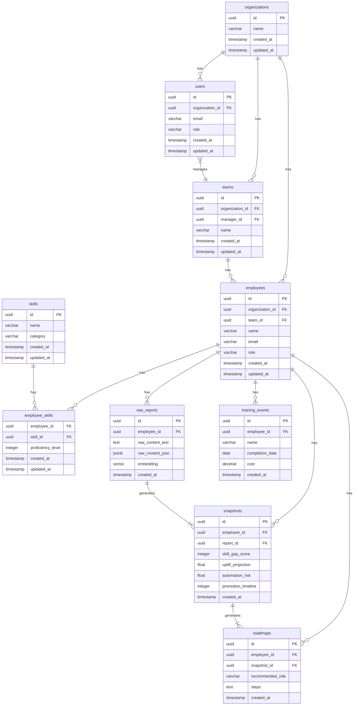

# Data Model & Schema

## 1. Introduction

This document defines the data model and database schema for the GoCareerPath B2B platform. The schema is designed for PostgreSQL and utilizes the `pgvector` extension for handling vector embeddings.

## 2. Entity-Relationship Diagram (ERD)



## 3. Table Definitions

### `organizations`

Stores information about the customer companies.

```sql
CREATE TABLE organizations (
    id UUID PRIMARY KEY DEFAULT gen_random_uuid(),
    name VARCHAR(255) NOT NULL,
    created_at TIMESTAMPTZ DEFAULT now(),
    updated_at TIMESTAMPTZ DEFAULT now()
);
```

### `users`

Stores information about the manager and admin users of the platform.

```sql
CREATE TABLE users (
    id UUID PRIMARY KEY DEFAULT gen_random_uuid(),
    organization_id UUID NOT NULL REFERENCES organizations(id),
    email VARCHAR(255) UNIQUE NOT NULL,
    role VARCHAR(50) NOT NULL, -- e.g., 'manager', 'admin'
    created_at TIMESTAMPTZ DEFAULT now(),
    updated_at TIMESTAMPTZ DEFAULT now()
);
```

### `teams`

Stores information about the teams within an organization.

```sql
CREATE TABLE teams (
    id UUID PRIMARY KEY DEFAULT gen_random_uuid(),
    organization_id UUID NOT NULL REFERENCES organizations(id),
    manager_id UUID REFERENCES users(id),
    name VARCHAR(255) NOT NULL,
    created_at TIMESTAMPTZ DEFAULT now(),
    updated_at TIMESTAMPTZ DEFAULT now()
);
```

### `employees`

Stores information about the employees of a customer company.

```sql
CREATE TABLE employees (
    id UUID PRIMARY KEY DEFAULT gen_random_uuid(),
    organization_id UUID NOT NULL REFERENCES organizations(id),
    team_id UUID REFERENCES teams(id),
    name VARCHAR(255) NOT NULL,
    email VARCHAR(255) UNIQUE NOT NULL,
    role VARCHAR(255),
    created_at TIMESTAMPTZ DEFAULT now(),
    updated_at TIMESTAMPTZ DEFAULT now()
);
```

### `skills`

A taxonomy of skills.

```sql
CREATE TABLE skills (
    id UUID PRIMARY KEY DEFAULT gen_random_uuid(),
    name VARCHAR(255) UNIQUE NOT NULL,
    category VARCHAR(255),
    created_at TIMESTAMPTZ DEFAULT now(),
    updated_at TIMESTAMPTZ DEFAULT now()
);
```

### `employee_skills`

A join table linking employees to skills and their proficiency.

```sql
CREATE TABLE employee_skills (
    employee_id UUID NOT NULL REFERENCES employees(id),
    skill_id UUID NOT NULL REFERENCES skills(id),
    proficiency_level INTEGER, -- e.g., 1-5 scale
    PRIMARY KEY (employee_id, skill_id),
    created_at TIMESTAMPTZ DEFAULT now(),
    updated_at TIMESTAMPTZ DEFAULT now()
);
```

### `raw_reports`

Stores the raw consumer career reports.

```sql
-- Requires pgvector extension: CREATE EXTENSION vector;
CREATE TABLE raw_reports (
    id UUID PRIMARY KEY DEFAULT gen_random_uuid(),
    employee_id UUID NOT NULL REFERENCES employees(id),
    raw_content_text TEXT,
    raw_content_json JSONB,
    embedding VECTOR(1536), -- Dimension depends on the embedding model
    created_at TIMESTAMPTZ DEFAULT now()
);
```

### `snapshots`

Stores the structured data extracted from each report.

```sql
CREATE TABLE snapshots (
    id UUID PRIMARY KEY DEFAULT gen_random_uuid(),
    employee_id UUID NOT NULL REFERENCES employees(id),
    report_id UUID NOT NULL REFERENCES raw_reports(id),
    skill_gap_score INTEGER,
    uplift_projection FLOAT,
    automation_risk FLOAT,
    promotion_timeline INTEGER, -- in months
    created_at TIMESTAMPTZ DEFAULT now()
);
```

### `roadmaps`

Stores the career roadmap generated from a snapshot.

```sql
CREATE TABLE roadmaps (
    id UUID PRIMARY KEY DEFAULT gen_random_uuid(),
    employee_id UUID NOT NULL REFERENCES employees(id),
    snapshot_id UUID NOT NULL REFERENCES snapshots(id),
    recommended_role VARCHAR(255),
    steps TEXT, -- Could be JSONB for a more structured roadmap
    created_at TIMESTAMPTZ DEFAULT now()
);
```

### `training_events`

Stores information about training and learning activities.

```sql
CREATE TABLE training_events (
    id UUID PRIMARY KEY DEFAULT gen_random_uuid(),
    employee_id UUID NOT NULL REFERENCES employees(id),
    name VARCHAR(255) NOT NULL,
    completion_date DATE,
    cost DECIMAL(10, 2),
    created_at TIMESTAMPTZ DEFAULT now()
);
