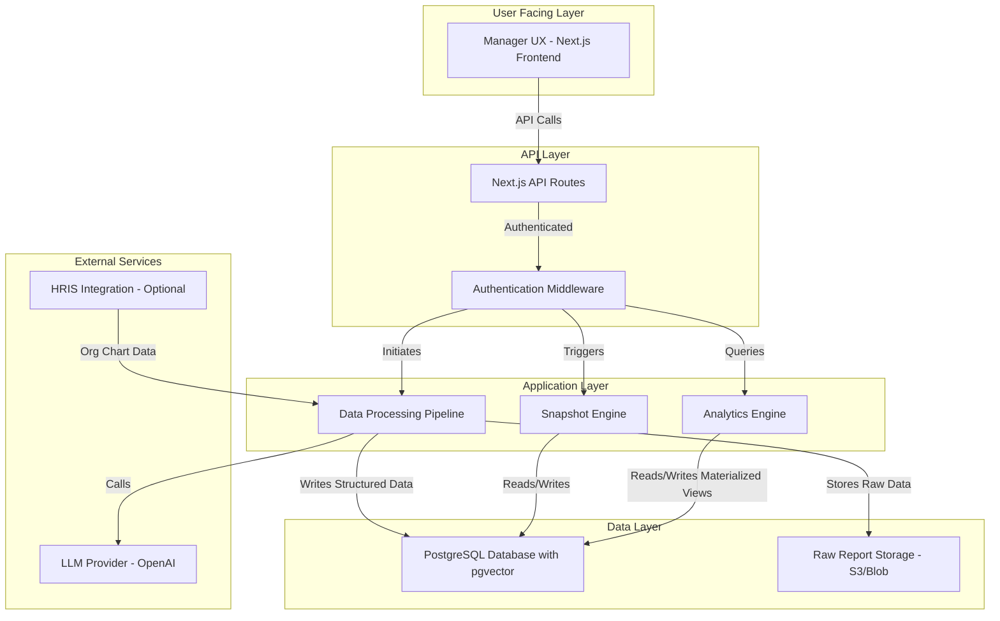

# System Architecture

## Component Descriptions

*   **Manager UX (Next.js Frontend):** The user interface for managers to interact with the platform. It will be a single-page application built with React and Next.js.
*   **Next.js API Routes:** The backend for the application, handling requests from the frontend, authenticating users, and interacting with the application and data layers.
*   **Authentication Middleware:** Ensures that all API requests are properly authenticated and authorized.
*   **Snapshot Engine:** A service responsible for generating and updating employee skill snapshots based on new data.
*   **Analytics Engine:** A service that computes and materializes team and organizational level analytics.
*   **Data Processing Pipeline:** A set of functions and workers that ingest raw career reports, process them using an LLM, and store the structured data.
*   **PostgreSQL Database:** The primary database for storing all structured data, including user information, skills, snapshots, and analytics. The `pgvector` extension is used for storing and querying embeddings.
*   **Raw Report Storage:** A dedicated storage solution (like Amazon S3 or Azure Blob Storage) for the raw text and JSON of the career reports.
*   **LLM Provider:** An external service (e.g., OpenAI) that is used for extracting structured data from the raw reports.
*   **HRIS Integration:** An optional integration with a company's Human Resource Information System to automate the import of the organizational chart.
